### 为了方便自定义打包工具，本人开发了一个基于Wix开发的免费打包工具，目前是基于VS2022(MSBuild)或Shell脚本生成的安装包，可自定义检测.NetFramewrok版本，自定义操作等，马上会发布界面化操作生成安装包的工具（敬请期待）。有问题可加QQ群交流：658794308，欢迎大家参与开发！

### 安装界面分为六步：
- 欢迎界面
- 用户许可
- 安装组件
- 安装进度
- 安装完成

### 1.原生Msi安装包
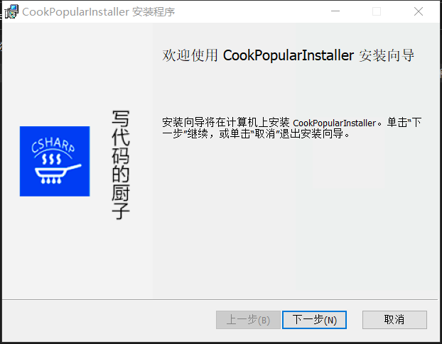
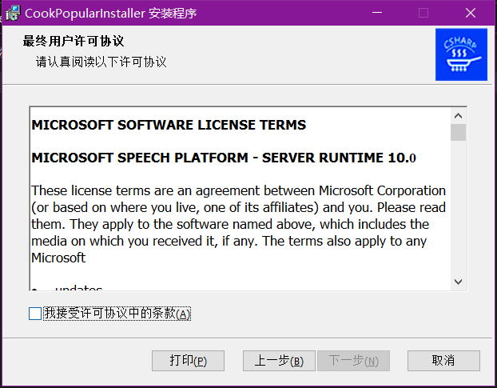
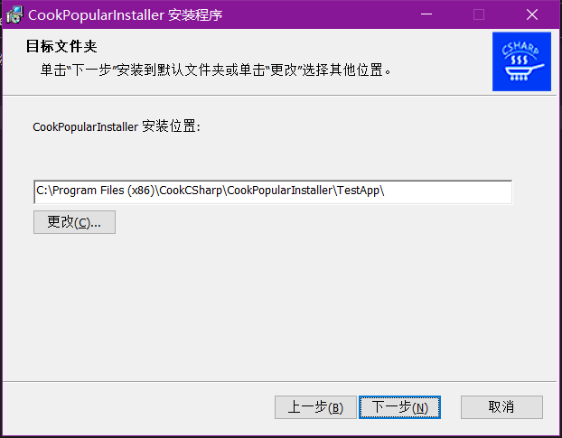
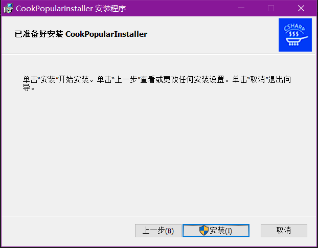
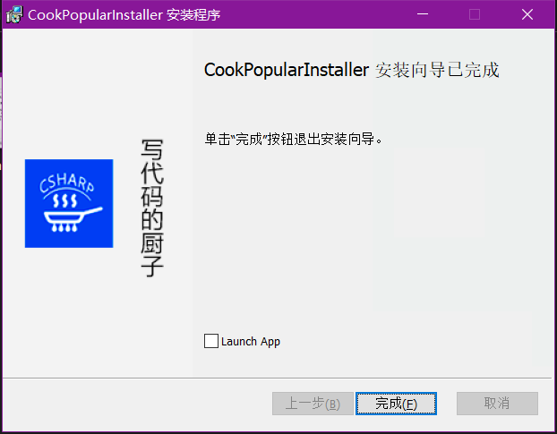

### 2.原生Exe安装包
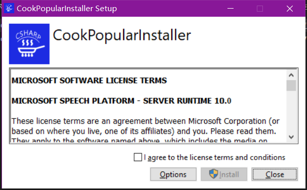
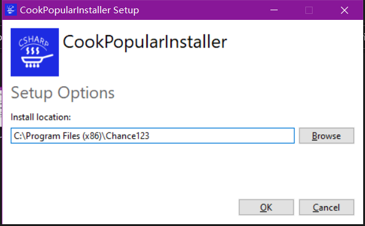
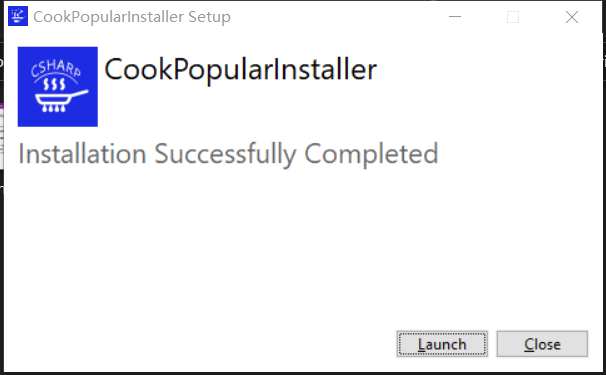

### 3.自定义Exe安装包
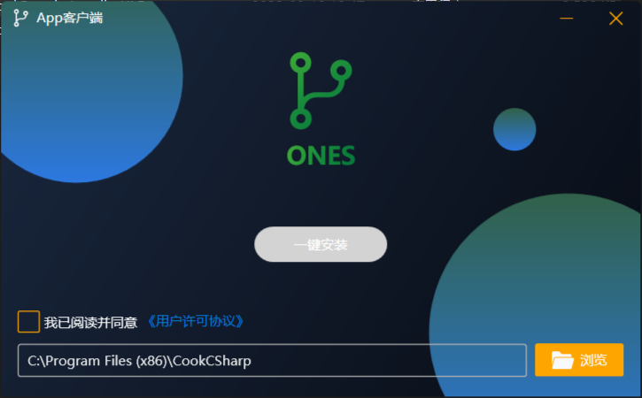
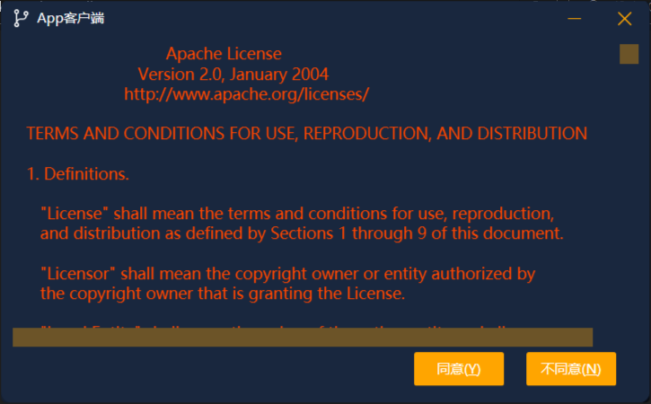
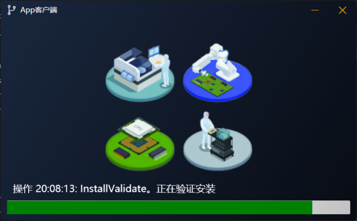

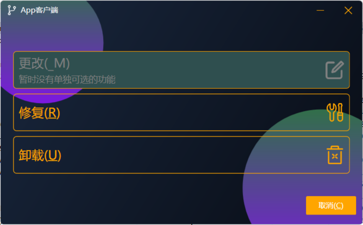

### 查看按照程序运行日志
    生成安装包完成后，进入安装包路径，使用命令"\CookPopularInstaller.exe -l "log.log"可生成日志文件

### 批量添加文件到wxs中
    "C:\Program Files (x86)\WiX Toolset v3.11\bin\heat.exe" dir . -o out.wxs -cg MyComponentGroup -sfrag -gg -g1

### 生成安装包
    "C:\Program Files (x86)\WiX Toolset v3.11\bin\light.exe" -ext WixUIExtension -cultures:en-us -dWixUILicenseRtf=Resources\license.rtf CookPopularInstaller.Msi.wixobj -out CookPopularInstaller.msi

### 注册表删除应用
    计算机\HKEY_LOCAL_MACHINE\SOFTWARE\WOW6432Node\Microsoft\Windows\CurrentVersion\Uninstall  与控制面板有关
    计算机\HKEY_LOCAL_MACHINE\SOFTWARE\Microsoft\Windows\CurrentVersion\Installer\UserData\S-1-5-18\Products  安装包检测是否安装有关
    计算机\HKEY_CLASSES_ROOT\Installer\Dependencies\安装包的具体ID，即guid
    计算机\HKEY_CLASSES_ROOT\Installer\Products\安装包的具体ID的倒序